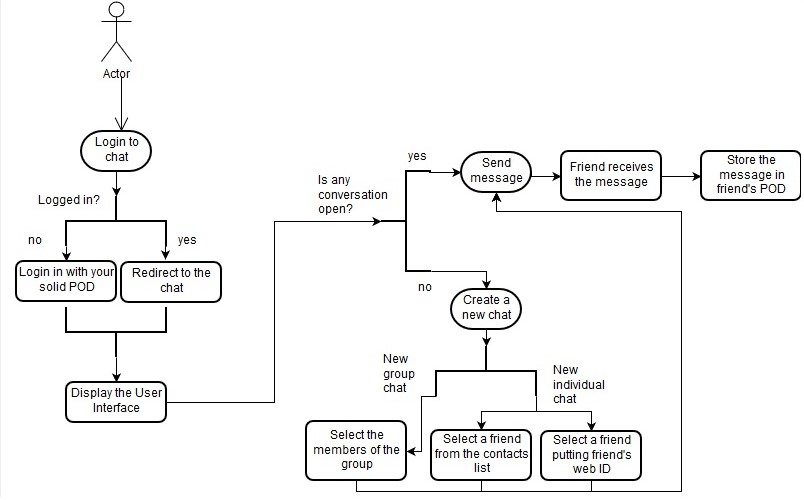

[[section-runtime-view]]
== Runtime View

****
In this document we describe the main process of our application, since the user enter to the login window till the same user send a message to the chat (group chat or individual chat).

****

