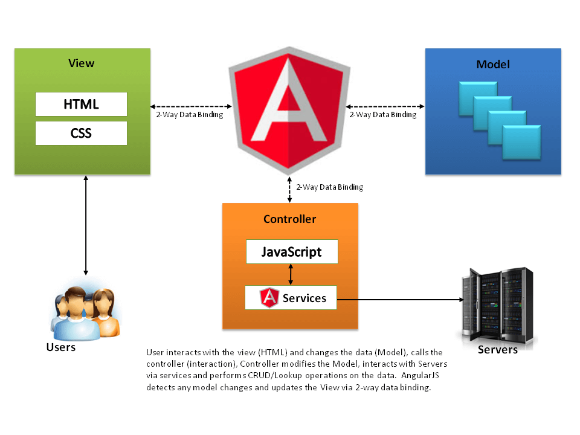

[[section-solution-strategy]]
= Solution Strategy

=== Technological decisions and reaching the quality goals

****
The main objective is to achieve a chat that meets all the quality requirements detailed in the first section. The first and great technological decision is to use SOLID. SOLID could be defined as a set of modular specifications, which are based on and extend the Internet's base technology (HTTP, REST, HTML). SOLID https://github.com/solid/solid-spec[specifications] are in GitHub.

Within the SOLID ecosystem, users decide where to store the data and who accesses it. Photos, messages, contacts... are stored in your Solid POD. This POD is handled by you and can be moved at any time. You decide who has access rights to the data and the synchronization is not necessary, as the data remains with you. To make an analogy, a POD is like your own USB for the Web, which you access from anywhere (Availability). Thanks to its use, safety, which is our main quality goal, is highly encouraged. How the information is used depends exclusively on the user.

Another decision is the use of TypeScript, a free and open source programming language developed and maintained by Microsoft. It is a superset of JavaScript, which essentially adds static typing and class-based objects. TypeScript can be used to develop JavaScript applications that will run on the client or server side (Node.js). This decision led to using https://angular.io/[Angular] as a framework for the web application. Among its advantages is speed and performance when generating code, it is universal, facilitates the division of code, increases productivity, etc. SOLID documentation recommends its use because of the large number of useful libraries it provides that facilitate development. All these advantages provided by Angular, guarantee us the efficiency and reliability of the app. Also the fact of being universal increases compatibility.

Finally, we will explain Node.js, which is a Node.js is a JavaScript runtime built on Chrome's V8 JavaScript engine. Taking advantage of the V8 engine allows Node to provide a server-side execution environment that compiles and runs javascript at incredible speeds (Efficiency).
****

=== Design Patterns

****

Angular tries to increase the number of browser-based applications with apability of *Model View Controller (MVC)*. Our application will be based on this pattern as well, which separates the data and business logic of an application from its representation and the module in charge of managing events and communications. For this, we will distinguish three fundamental parts: the Model, the View and the Controller.

* The *models* define the relevant mechanisms to manage the application data. The persistence system is accessed through the models and the data is created, modified or retrieved.

* The *views* define the user interface aspect of the application, which is, the part that will be sent to the web browsers of the clients and therefore the information that the users will perceive. In most applications the views will be composed of HTML, CSS and JavaScript, and may also include small scripts of language executed on the server, which is usually used as a link between views and controllers.

* The *controllers* are responsible for offering the catalog of actions that the web application is capable of (and that will correspond to the business logic implemented), when the user selects one of these actions the controller must execute the logic of the associate business and generate a response, in many cases these responses will generate a change in the current view of the application.

****

=== Decisiones organizativas

****
****

